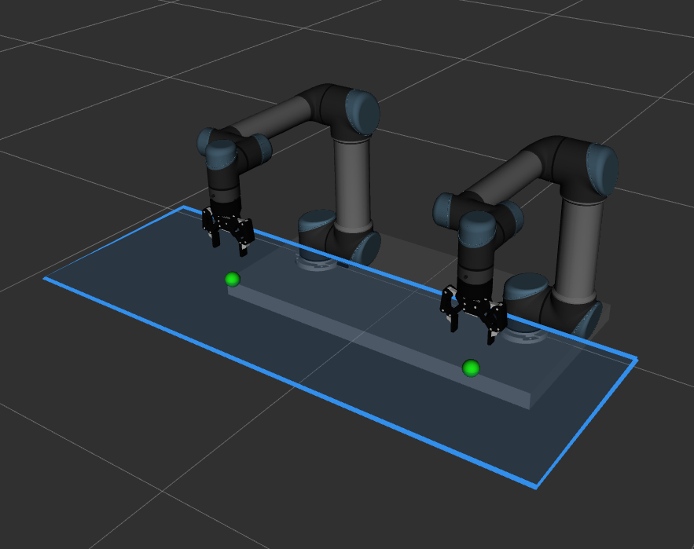
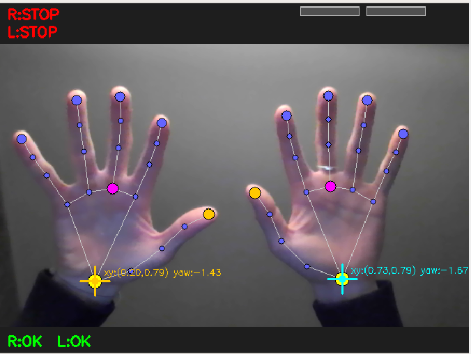

# Dual UR5 Hand-Tracking Teleoperation

Real-time teleoperation of two UR5 robot arms using hand and wrist tracking from a single webcam. Each hand independently controls one arm — position, orientation, and gripper — with no physical controller required.



---

## Overview

The system uses [MediaPipe Hands](https://developers.google.com/mediapipe/solutions/vision/hand_landmarker) to detect both hands in a webcam feed and maps their position and wrist rotation to end-effector targets in Cartesian space. Robot motion is executed through **MoveIt 2 Servo**, which converts Cartesian velocity commands into joint trajectories in real time.

- **Right hand** → right arm + right gripper
- **Left hand** → left arm + left gripper
- **Closed fist** → activate tracking from current arm position
- **Open hand** → freeze arm in place
- **Thumb angle** (while fist closed) → gripper open/close



---

## Packages

| Package | Role |
|---|---|
| `ur5_dual_robot_description` | URDF/xacro for the dual-arm cell (two UR5s on a shared platform) |
| `ur5_dual_robot_moveit_config` | MoveIt 2 config: SRDF, servo config, IKFast kinematics |
| `dual_ur5_left_arm_ikfast_plugin` | IKFast plugin for the left arm |
| `dual_ur5_right_arm_ikfast_plugin` | IKFast plugin for the right arm |
| `ur5_dual_robot_bringup` | Launch files that wire everything together |
| `ur5_dual_robot_teleop` | Hand tracking, filtering, control, and gripper nodes |
| `ros2_robotiq_gripper` | Driver for the Robotiq 2F-85 grippers |

---

## Installation

### Prerequisites

- ROS 2 Humble
- MoveIt 2
- Python ≥ 3.10

```bash
sudo apt install ros-humble-moveit ros-humble-moveit-servo
pip install mediapipe opencv-python
```

### Build

```bash
cd ~/ros2_ws
colcon build --symlink-install
source install/setup.bash
```

> **Note:** Do not build inside a conda environment. Conda's Python interpreter overrides ROS's and breaks `ros2 run` lookups. Run `conda deactivate` before building or launching.

---

## Running

### Hand tracking teleoperation

```bash
ros2 launch ur5_dual_robot_bringup hand_tracking.launch.py
```

This starts (with staggered delays to allow MoveIt to initialize):

1. MoveIt 2 `move_group` + `robot_state_publisher` + `ros2_control`
2. Joint trajectory controllers for both arms
3. MoveIt Servo nodes (left and right)
4. Gripper controllers and driver node
5. Workspace visualizer (RViz markers)
6. Hand tracker node (webcam + MediaPipe)
7. Dual-arm teleop node (control loop)

By default the analytical (IKFast) solver is used. To switch to the numerical (KDL) solver:

```bash
ros2 launch ur5_dual_robot_bringup hand_tracking.launch.py kinematics_solver:=numerical
```

### Keyboard teleoperation

```bash
ros2 launch ur5_dual_robot_bringup keyboard_teleop.launch.py
```

### Kalman filter tuner

Run this alongside `hand_tracker_node` to measure your camera's actual noise and compute optimal filter parameters:

```bash
ros2 run ur5_dual_robot_teleop kf_tuner
```

---

## Robot Integration — MoveIt 2 and MoveIt Servo

The arms are controlled via **MoveIt Servo**, a MoveIt 2 component that accepts continuous Cartesian velocity commands (`TwistStamped`) and converts them to joint-space commands at the `ros2_control` level without motion planning or collision checking overhead.

```
hand → target Pose2D → PD controller → TwistStamped → MoveIt Servo → joint controllers → UR5
```

One Servo instance runs per arm (`left_servo_node` / `right_servo_node`). The teleop node sends delta twist commands expressed in the `world` frame; Servo handles Jacobian inversion and joint limit enforcement internally.

### IKFast Solver

The MoveIt kinematics configuration uses **IKFast**-generated analytical solvers (`dual_ur5_left_arm_ikfast_plugin` and `dual_ur5_right_arm_ikfast_plugin`) rather than the default KDL numerical solver.

IKFast advantages for real-time teleoperation:

- Computes all closed-form solutions in < 1 ms (vs. iterative KDL which can take 5–50 ms and may fail to converge)
- Deterministic — no convergence failures or solution drift under high update rates
- Configured with a near-zero timeout (`kinematics_solver_timeout: 0.005 s`)

Each arm has its own independently generated plugin because the two arms are mounted symmetrically and their kinematic chains differ in base frame orientation.

---

## Hand Tracking and Smoothing

### Hand tracker (`hand_tracker_node`)

Runs MediaPipe Hands in a background thread at up to `fps_cap` Hz. For each detected hand it publishes:

- `/hand_pose/right` and `/hand_pose/left` — wrist `(x, y)` in normalized image coordinates and wrist yaw encoded as a quaternion
- `/hand_tracker/active` and `/hand_tracker/left/active` — `Bool`: is a fist closed?
- `/hand_tracker/gripper` and `/hand_tracker/left/gripper` — `Float64`: thumb angle mapped to [0, 1]

An optional EMA pre-filter runs inside the tracker before publishing (`alpha_xy`, `alpha_yaw`). Setting alpha to `1.0` disables this stage and passes raw measurements through.

### Input filter (`hand_tracking_input`)

A second EMA filtering stage runs inside the teleop node at the full 100 Hz control rate, independent of the camera frame rate. The filter is an **exponential moving average** applied separately to x, y, and yaw:

```
filtered = alpha × measurement + (1 − alpha) × filtered_prev
```

`ema_alpha` controls the trade-off between responsiveness and smoothness. A value of `1.0` is a pass-through (no filtering); lower values smooth out measurement noise at the cost of slight lag. The filter only updates when a new camera measurement arrives, so the output holds the last filtered value between frames rather than extrapolating.

### Delta tracking

Position control uses a **delta** scheme: when the fist closes, the hand's current image position is captured as a reference point. All subsequent movement is measured as a displacement from that reference and mapped to a workspace displacement. This means the arm moves *relative to where it was when you closed your fist* — there is no fixed hand-to-robot position mapping, so you can reposition your hand freely between tracking sessions.

---

## Control

### PD controller

The teleop node runs a PD controller at 100 Hz per arm:

```
velocity = Kp × error + Kd × d(error)/dt
```

`error` is the difference between the Cartesian target (computed from hand offset + reference EEF pose) and the live end-effector pose read from TF. The resulting `(vx, vy, wz)` is clamped to `max_linear` / `max_angular` and published as a `TwistStamped` to MoveIt Servo.

The derivative term (`kd_linear`, `kd_angular`) damps overshoot when the target position stops moving. Set `kd` to `0.0` for pure proportional control.

### Workspace

A rectangular workspace is defined in the `world` frame by a centre point, width, and depth. The arm target is always clamped to this box with an additional `boundary_margin` safety margin. The boundary is visualized as a wire-frame rectangle in RViz.

---

## Parameters (`config/teleop_params.yaml`)

### `workspace`

| Parameter | Default | Description |
|---|---|---|
| `frame_id` | `world` | TF frame the workspace is defined in |
| `center_x` | `-0.05` m | Workspace centre X |
| `center_y` | `0.5` m | Workspace centre Y |
| `center_z` | `0.2` m | Fixed operating height (Z is not controlled by hand tracking) |
| `width` | `1.4` m | Extent in X |
| `depth` | `0.5` m | Extent in Y |

### `hand_tracker`

| Parameter | Default | Description |
|---|---|---|
| `show_window` | `false` | Open an OpenCV preview window |
| `show_roi` | `false` | Draw the ROI rectangle on the preview |
| `fps_cap` | `20` | Max camera inference rate (Hz) — lower reduces CPU load |
| `model_complexity` | `1` | MediaPipe model quality: 0 = lite (fast), 1 = full (accurate) |
| `cam_index` | `0` | `/dev/videoN` index of the webcam |
| `cam_width` | `640` | Capture width (px) |
| `cam_height` | `480` | Capture height (px) |
| `roi.x1 / y1 / x2 / y2` | `0.15 / 0.05 / 0.85 / 0.95` | Valid tracking region (normalized 0–1); hands outside are ignored |
| `smoothing.alpha_xy` | `0.7` | EMA weight for XY position inside the tracker (1.0 = pass-through) |
| `smoothing.alpha_yaw` | `0.7` | EMA weight for wrist yaw inside the tracker |
| `safety.max_jump` | `0.15` | Max allowed position jump per frame (image fraction) — larger jumps are rejected as outliers |
| `safety.lost_timeout` | `0.5` s | Time after last detection before hand is reported as lost |
| `gestures.fist_threshold` | `0.30` | Avg fingertip–wrist distance (image fraction) below which a fist is declared |
| `gestures.thumb_angle_min` | `5.0` ° | Thumb angle mapped to gripper fully closed |
| `gestures.thumb_angle_max` | `38.0` ° | Thumb angle mapped to gripper fully open |

### `hand_tracking_input`

| Parameter | Default | Description |
|---|---|---|
| `invert_x` | `true` | Mirror X motion (needed because the camera faces the user) |
| `invert_y` | `false` | Flip Y motion |
| `dead_zone` | `0.08` | Min hand displacement (image fraction) before movement is registered — prevents drift at rest |
| `yaw_scale` | `2.0` | Hand yaw [rad] → robot wrist rotation [rad] gain |
| `yaw_dead_zone` | `0.03` rad | Min wrist rotation delta before it is accumulated |
| `active_hold_sec` | `0.15` s | Keep arm active for this long after fist detection drops — prevents single-frame dropout from stopping the arm |
| `filter_mode` | `kalman` | Smoothing mode: `none`, `ema`, or `kalman` |
| `ema_alpha` | `0.7` | EMA weight applied to each new measurement (only used when `filter_mode: ema`) |
| `kalman.sigma_a` | `4.9` | Position process noise std dev (img_frac/s²) — tune with `kf_tuner` |
| `kalman.sigma_a_yaw` | `39.4` | Yaw process noise std dev (rad/s²) |
| `kalman.sigma_r_pos` | `0.002` | Position measurement noise std dev (img_frac) |
| `kalman.sigma_r_yaw` | `0.0014` | Yaw measurement noise std dev (rad) |

### `controllers`

| Parameter | Default | Description |
|---|---|---|
| `publish_rate` | `100` Hz | Control loop and marker publish rate |
| `boundary_margin` | `0.03` m | Safety clearance from workspace edge |
| `hand_tracking.kp_linear` | `6.0` | Linear PD proportional gain |
| `hand_tracking.kd_linear` | `0.1` | Linear PD derivative gain (set to 0 for pure-P) |
| `hand_tracking.kp_angular` | `2.0` | Angular PD proportional gain |
| `hand_tracking.kd_angular` | `0.1` | Angular PD derivative gain |
| `hand_tracking.max_linear` | `1.0` m/s | Velocity cap sent to MoveIt Servo |
| `hand_tracking.max_angular` | `1.0` rad/s | Angular velocity cap sent to MoveIt Servo |

### `visualization`

| Parameter | Default | Description |
|---|---|---|
| `publish_rate` | `100` Hz | RViz marker publish rate |
| `target_arrow_length` | `0.12` m | Length of the wrist orientation arrow marker |
| `target_sphere_scale` | `0.06` m | Diameter of the target position sphere |
| `eef_sphere_scale` | `0.04` m | Diameter of the live EEF position sphere |

---

## Topics

| Topic | Type | Description |
|---|---|---|
| `/hand_pose/right` | `PoseStamped` | Right wrist position (normalized) + yaw |
| `/hand_pose/left` | `PoseStamped` | Left wrist position (normalized) + yaw |
| `/hand_tracker/active` | `Bool` | Right fist closed? |
| `/hand_tracker/left/active` | `Bool` | Left fist closed? |
| `/hand_tracker/gripper` | `Float64` | Right gripper command (0 = closed, 1 = open) |
| `/hand_tracker/left/gripper` | `Float64` | Left gripper command |
| `/hand_tracker/image` | `Image` | Annotated webcam feed |
| `/right_servo_node/delta_twist_cmds` | `TwistStamped` | Cartesian velocity command to right arm |
| `/left_servo_node/delta_twist_cmds` | `TwistStamped` | Cartesian velocity command to left arm |
| `/teleop/target_markers` | `MarkerArray` | RViz markers showing target EEF positions |
| `/workspace/markers` | `MarkerArray` | RViz workspace boundary visualization |
